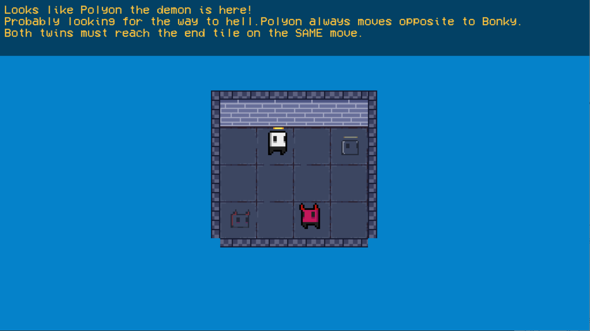
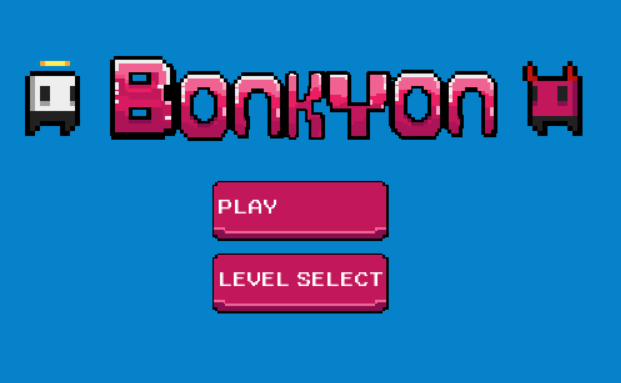

# Bonkyon

Prototype for a little puzzler made with Lua, Love2D and Aseprite.
Play [here](https://injuly.itch.io/bonkyon) on itch.
The player controls two minions who move in opposite directions.
The goal is to make each minion stand on it's respective 'end tile'
in a maze.

## Screenshots

## Running from source
Clone this repo to your machine, then run `love .` in the project
directory. You will need to have Love2D installed.
